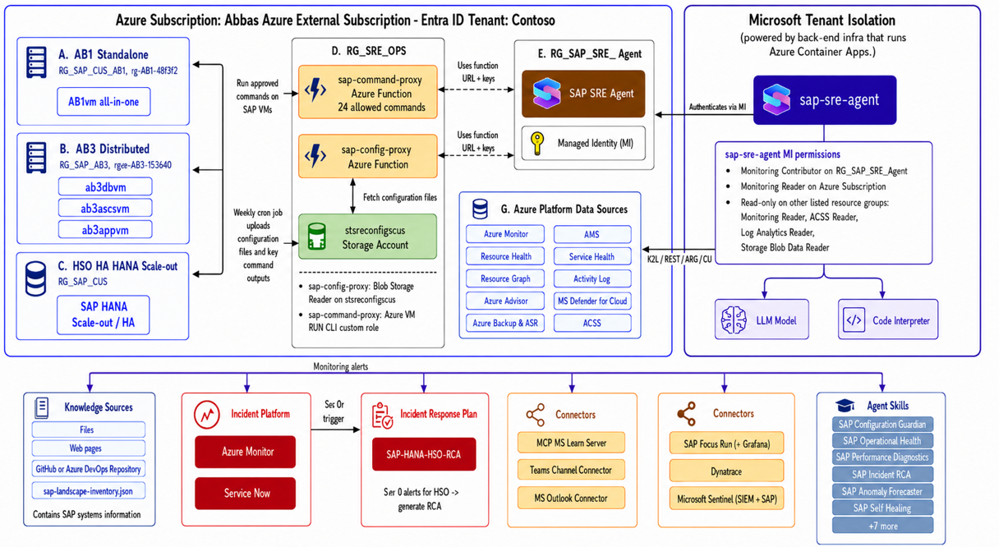

# SAP Azure SRE Agent

12 SRE skills + 1 command runner for SAP HANA and NetWeaver on Azure. All read-only — zero changes to your SAP environment.

**10 skills work on Day 1** with just Azure APIs. Deploy the optional command proxy to unlock live VM queries.

## Architecture



## Skills

| # | Skill | What it does | Proxy needed? |
|---|-------|-------------|---------------|
| 1 | `sap-landscape-discovery` | SAP system inventory, VM power state, topology | No |
| 2 | `sap-operational-health` | 5-layer health dashboard (infra/OS/cluster/HANA/app) | Optional |
| 3 | `sap-config-validator` | STAF-aligned config checks from Azure/sap-automation-qa | Optional |
| 4 | `sap-ha-cluster-health` | Pacemaker/HSR status, takeover readiness | Optional |
| 5 | `sap-incident-analysis` | Cross-layer root cause analysis | No |
| 6 | `sap-resiliency-assessment` | Azure Advisor + ACSS reliability checks | No |
| 7 | `sap-performance-diagnostics` | HANA memory, disk IOPS, savepoint diagnostics | Optional |
| 8 | `sap-deployment-readiness` | SKU availability, quota, SAP certification | No |
| 9 | `sap-cost-analysis` | Per-system cost breakdown, RI coverage, savings | No |
| 10 | `sap-trend-analysis` | Memory/disk/CPU trend projection via AMS | No |
| 11 | `sap-self-healing` | Log volume full, backup staleness, sysctl drift | Yes |
| 12 | `sap-maintenance-handler` | Azure scheduled maintenance graceful handling | Yes |
| — | `sap-command-runner` | 14 read-only commands on SAP VMs | Yes |

## Prerequisites

- **Azure CLI** (`az`) — [install](https://aka.ms/installazurecli)
- SAP workloads running on Azure VMs (HANA + NetWeaver)
- Azure Monitor for SAP Solutions (AMS) with HANA provider configured
- Azure SRE Agent created at [sre.azure.com](https://sre.azure.com)

## Quick Start (Day 1 — No Proxy)

### 1. Import Skills

1. SRE Agent portal → **Plugins** → **Manage marketplaces** → **Add**
2. Enter: `mcaps-microsoft/sap-azure-sre-agent` → **Resolve** → **Add**
3. Click plugin → **Install** (imports all 13 skills)

### 2. Configure SRE Agent

- **Managed Resources:** Add SAP resource groups + AMS resource group
- **Connectors:** Add Log Analytics Workspace (AMS workspace ID)
- **Knowledge Sources:** Upload `config/sap-landscape-inventory.template.json` (filled with your SAP systems)
- **Team Onboarding:** Paste filled-in `onboarding/team-onboarding.template.md`

**Done.** 10 skills are now operational — try "Run resiliency assessment" or "Show SAP landscape".

## Full Setup (Day 2 — With Proxy)

Deploy the command proxy to unlock live VM queries, config validation, and the remaining skills.

### 3. Deploy Infrastructure

The deploy script creates all Azure resources and deploys the container app in one step (~5 min):

```powershell
git clone -b dev https://github.com/mcaps-microsoft/sap-azure-sre-agent.git
cd sap-azure-sre-agent

az login
.\infra\deploy-sre-infra.ps1 `
    -SubscriptionId "<your-subscription-id>" `
    -StorageAccountName "<globally-unique-name>"
```

That's it — just 2 parameters. The script creates a VNet with a dedicated subnet, builds the
container image in ACR, and deploys to Azure Container Apps with VNet integration.

Override defaults as needed: `-ResourceGroupName`, `-ProxyName`, `-Location`,
`-VNetName`, `-VNetAddressSpace`, `-SubnetPrefix`. Use custom VNet address space if you
need to avoid overlap with existing networks (default: `10.60.0.0/16`).

**After the script completes, assign RBAC on each SAP resource group** (use the UMI Principal ID from the output):

```powershell
az role assignment create --assignee-object-id <UMI-PRINCIPAL-ID> --assignee-principal-type ServicePrincipal --role "Reader" --scope "/subscriptions/<sap-sub>/resourceGroups/<sap-rg>"
az role assignment create --assignee-object-id <UMI-PRINCIPAL-ID> --assignee-principal-type ServicePrincipal --role "Virtual Machine Contributor" --scope "/subscriptions/<sap-sub>/resourceGroups/<sap-rg>"
```

**Add SAP VM subnet(s) to storage firewall** (so VMs can upload config snapshots):

```powershell
az storage account network-rule add --account-name <storage-account> --subnet "<sap-vm-subnet-resource-id>"
```

### 4. Import updated Team Onboarding

Update the Team Onboarding with proxy URL and API key from the deploy script output.

### 5. Deploy Collector to SAP VMs

The collector script gathers SAP/HANA/OS configs from each VM and uploads to blob storage weekly.

**a) Download the collector script** (already uploaded to storage by the deploy script):

```bash
# On each SAP VM (as root):
mkdir -p /opt/sre
az login --identity --username <UMI-CLIENT-ID> --output none
az storage blob download --account-name <STORAGE-ACCOUNT> --container-name sap-configs \
    --name scripts/collect-sap-configs.sh --file /opt/sre/collect-sap-configs.sh --auth-mode login
chmod +x /opt/sre/collect-sap-configs.sh
```

**b) Create the environment file** (`/opt/sre/sre.env`):

```bash
cat > /opt/sre/sre.env << 'EOF'
SRE_STORAGE_ACCOUNT=<your-storage-account-name>
SRE_CONTAINER=sap-configs
SRE_UMI_CLIENT_ID=<your-umi-client-id>
EOF
chmod 600 /opt/sre/sre.env
```

**c) Create the cron wrapper** (`/opt/sre/run-collector.sh`):

```bash
cat > /opt/sre/run-collector.sh << 'EOF'
#!/bin/bash
source /opt/sre/sre.env

# === EDIT: Set values for THIS VM ===
SID="AB1"           # SAP System ID
DB_SID="DB1"         # HANA Database SID
ROLES="db,ascs,app"  # Roles on this VM: db, ascs, app, sbd (comma-separated)
HANA_INST="00"       # HANA instance number (db role only)
ASCS_INST="01"       # ASCS instance number (ascs role only)
APP_INST="02"        # App instance number (app role only)
# ====================================

ARGS="--sid $SID --db-sid $DB_SID --roles $ROLES"
[ -n "$HANA_INST" ] && ARGS="$ARGS --hana-inst $HANA_INST"
[ -n "$ASCS_INST" ] && ARGS="$ARGS --ascs-inst $ASCS_INST"
[ -n "$APP_INST" ]  && ARGS="$ARGS --app-inst $APP_INST"

/opt/sre/collect-sap-configs.sh $ARGS >> /var/log/sre-config-collect.log 2>&1
EOF
chmod +x /opt/sre/run-collector.sh
```

**d) Set up weekly cron** (every Sunday at 2:00 AM):

```bash
echo "0 2 * * 0 root /opt/sre/run-collector.sh" > /etc/cron.d/sre-collector
chmod 644 /etc/cron.d/sre-collector
```

**e) Assign the UMI to the VM** (so it can upload to blob storage):

```powershell
az vm identity assign -g <sap-rg> -n <vm-name> --identities <UMI-RESOURCE-ID>
```

**f) Add SAP VM subnet to storage firewall** (so VMs can reach the storage account):

```powershell
az storage account network-rule add --account-name <STORAGE-ACCOUNT> \
    --subnet "/subscriptions/<sub>/resourceGroups/<rg>/providers/Microsoft.Network/virtualNetworks/<vnet>/subnets/<sap-subnet>"
```

## What Gets Created

```
rg-sre-ops  (or custom name via -ResourceGroupName)
├── sre-ops-umi              User-Assigned Managed Identity
├── <storage-account>        Storage Account (SAP configs, shared key disabled)
├── <acr>                    Azure Container Registry (Basic, container images)
├── vnet-sre-ops             Virtual Network (10.60.0.0/16 default)
│   └── sn-container-apps    Subnet (/23, delegated to Container Apps, Storage endpoint)
├── sre-ops-env              Container Apps Environment (VNet-integrated)
└── sap-sre-proxy            Container App (unified: config read + command execution)
```

### API Endpoints

| Method | Route | Description |
|--------|-------|-------------|
| GET | `/api/registry` | SAP landscape inventory |
| GET | `/api/config/{sid}/{hostname}/{path}` | Single config file |
| GET | `/api/configs/{sid}/{hostname}` | All configs for a VM |
| GET | `/api/configs/{sid}` | All configs for a system |
| GET | `/api/commands` | List allowed commands |
| GET | `/api/diag` | MI + ARM connectivity test |
| POST | `/api/command` | Execute command on SAP VM |
| GET | `/api/health` | Health check |

## RBAC Summary

| Identity | Role | Scope | Purpose |
|----------|------|-------|---------|
| sre-ops-umi | Storage Blob Data Owner | Storage account | Config read/write |
| sre-ops-umi | AcrPull | Container Registry | Pull container images |
| sre-ops-umi | Reader | Each SAP RG | VM discovery |
| sre-ops-umi | Virtual Machine Contributor | Each SAP RG | VM Run Command |
| agent-mi (auto) | Reader | SAP RGs + AMS RG | Azure API calls |
| agent-mi (auto) | Log Analytics Reader | AMS workspace | KQL queries |

## Skill Catalog

| Skill | Tier | Description |
|-------|------|-------------|
| SAP Landscape Discovery | T1 | System inventory, VM power state |
| SAP Operational Health | T1 | AMS health, VM metrics, alert coverage |
| SAP Performance Diagnostics | T1 | HANA memory, SQL probe, disk IOPS |
| SAP Deployment Readiness | T1 | SKU check, quota, zone availability |
| SAP Resiliency Assessment | T1 | HA architecture, zone coverage, SPOFs |
| SAP Cost Insights | T1 | Cost breakdown, RI coverage, savings |
| SAP Incident RCA | T2 | Cross-layer root cause analysis |
| SAP Configuration Guardian | T1+T3 | 59 config checks aligned with STAF |
| SAP HA & DR Guardian | T1+T3 | Pacemaker, HSR, failover forensics |
| SAP Anomaly Forecaster | T3 | Memory/disk trend projection |
| SAP Maintenance Autopilot | T4 | Graceful shutdown for scheduled maintenance |
| SAP Self-Healing | T4 | Log volume full, backup stale, sysctl drift |
| SAP Command Executor | Internal | 15 allowlisted VM commands via proxy |
| SAP ServiceNow Connector | Internal | ITSM integration (if configured) |
| SAP APM Connector | Internal | Dynatrace/Grafana integration (if configured) |

## Security

- **Command allowlist:** Only 15 specific commands can run on SAP VMs. No arbitrary shell execution.
- **No shared keys:** Storage uses identity-based auth. No secrets in code.
- **Network isolation:** Storage firewall Deny by default. Container App accesses storage via VNet integration + service endpoint. SAP VM subnets explicitly allowed via their own service endpoints.
- **Input sanitization:** All parameters shell-quoted (`shlex.quote`) and regex-validated.
- **Audit trail:** Every command execution logged to Application Insights.
