# SAP SRE Agent — Architecture Diagram v2

## Observe → Diagnose → Prevent → Heal

## Paste into mermaid.live (without the triple backtick fences)

```mermaid
graph TB
    classDef agent fill:#4B0082,stroke:#333,color:#fff
    classDef foundry fill:#6A0DAD,stroke:#333,color:#fff
    classDef func fill:#FF8C00,stroke:#333,color:#fff
    classDef storage fill:#00A36C,stroke:#333,color:#fff
    classDef ams fill:#C70039,stroke:#333,color:#fff
    classDef connector fill:#DAA520,stroke:#333,color:#fff
    classDef t1skill fill:#708090,stroke:#333,color:#fff
    classDef t2skill fill:#1E90FF,stroke:#FFD700,color:#fff,stroke-width:2px
    classDef t3skill fill:#B8860B,stroke:#FFD700,color:#fff,stroke-width:2px
    classDef t4skill fill:#8B0000,stroke:#FFD700,color:#fff,stroke-width:3px
    classDef alert fill:#DC143C,stroke:#333,color:#fff
    classDef identity fill:#8B4513,stroke:#333,color:#fff
    classDef platform fill:#2F4F4F,stroke:#333,color:#fff
    classDef infra fill:#1E90FF,stroke:#333,color:#fff
    classDef sap fill:#0078D4,stroke:#333,color:#fff
    classDef external fill:#228B22,stroke:#333,color:#fff
    classDef internal fill:#555555,stroke:#333,color:#fff

    subgraph MST["MS Tenant - Foundry East US 2"]
        SRE["sap-sre-agent"]:::agent
        LLM["LLM<br/>(Token Budget)"]:::foundry
        CI["Code Interpreter"]:::foundry
    end

    subgraph EXT["External Integrations"]
        direction LR
        SNOW["ServiceNow<br/>(conditional)"]:::external
        GRAF["Grafana/Focus Run<br/>(conditional)"]:::external
    end

    subgraph CONN["Connectors"]
        direction LR
        MCP["MCP-MSLearnDocs"]:::connector
        TEAMS["Teams<br/>(Approvals)"]:::connector
        OL["Outlook"]:::connector
    end

    subgraph T4["T4: Autonomous Remediation"]
        direction LR
        S11["Maintenance<br/>Autopilot"]:::t4skill
        S12["Self-<br/>Healing"]:::t4skill
    end

    subgraph T3["T3: Predictive Prevention"]
        direction LR
        S10["Anomaly<br/>Forecaster"]:::t3skill
        S04["Config<br/>Guardian"]:::t3skill
        S07["HA & DR<br/>Guardian"]:::t3skill
    end

    subgraph T2["T2: Incident Diagnosis"]
        S05["Incident<br/>RCA"]:::t2skill
    end

    subgraph T1["T1: Observability & Insights"]
        direction LR
        S01["Landscape<br/>Discovery"]:::t1skill
        S02["Deployment<br/>Readiness"]:::t1skill
        S03["Operational<br/>Health"]:::t1skill
        S06["Performance<br/>Diagnostics"]:::t1skill
        S08["Resiliency<br/>Assessment"]:::t1skill
        S09["Cost<br/>Insights"]:::t1skill
    end

    subgraph INT["Internal Tools"]
        direction LR
        CMD_INT["Command<br/>Executor"]:::internal
        SNOW_INT["ServiceNow<br/>Connector"]:::internal
        GRAF_INT["Grafana<br/>Bridge"]:::internal
    end

    subgraph KBINC["Knowledge + Incidents"]
        direction LR
        KBF["sap-landscape-inventory.json"]
        IRP["Sev0 Auto-RCA"]:::alert
    end

    SRE --- LLM
    SRE --- CI
    SRE --> CONN
    SRE --> T4
    SRE --> T3
    SRE --> T2
    SRE --> T1
    SRE --> KBINC
    T3 -->|"Approval via"| TEAMS
    T4 -->|"Notify via"| TEAMS

    INT --> EXT
    SNOW_INT --> SNOW
    GRAF_INT --> GRAF

    T2 --> INT
    T3 --> INT
    T4 --> INT

    subgraph SUB["Azure Subscription"]

        subgraph RGA["RG_SAP_SRE_Agent"]
            MI["User MI<br/>sap-sre-agent"]:::identity
            APPINS["App Insights"]:::infra
        end

        subgraph RGO["RG_SRE_OPS"]
            CFG["sap-config-proxy<br/>Azure Function"]:::func
            CMD["sap-command-proxy<br/>24 commands"]:::func
            ST["stsreconfigscus<br/>Storage"]:::storage
        end

        AB1["AB1 - Standalone HANA<br/>RG_SAP_CUS_AB1"]:::sap
        AB3["AB3 - Distributed HANA<br/>RG_SAP_AB3"]:::sap
        HSO["HSO - HA Scale-out<br/>RG_SAP_CUS<br/>8 VMs - Pacemaker"]:::sap

        subgraph RAMS["AMS"]
            AMS["AMS Instance"]:::ams
            LA["Log Analytics<br/>HANA + NW + OS"]:::ams
            AL1["Alert: HANA"]:::alert
            AL2["Alert: Cluster"]:::alert
        end

        subgraph DATA["Azure Platform Data Sources"]
            direction LR
            MON["Azure<br/>Monitor"]:::platform
            RH["Resource<br/>Health"]:::platform
            SH["Service<br/>Health"]:::platform
            ARG["Resource<br/>Graph"]:::platform
            ALOG["Activity<br/>Log"]:::platform
            ADV["Advisor"]:::platform
        end
    end

    SRE -->|"MI Reader"| SUB
    SRE -->|"Func Key"| CFG
    SRE -->|"Func Key"| CMD
    CFG -->|"Blob Reader"| ST
    CMD -->|"VM Run Cmd"| AB1
    CMD -->|"VM Run Cmd"| AB3
    CMD -->|"VM Run Cmd"| HSO
    AB1 -.->|"Cron"| ST
    AB3 -.->|"Cron"| ST
    HSO -.->|"Cron"| ST
    AMS ==>|"Monitors"| AB1
    AMS ==>|"Monitors"| AB3
    AMS ==>|"Monitors"| HSO
    AMS --> LA
    AL1 --- LA
    AL2 --- LA
    SRE -->|"KQL"| LA
    SRE -->|"REST/ARG"| DATA
```

## Skill Catalog (12 Customer-Facing + 3 Internal)

| # | Skill Name | Tiers | Agent Behavior |
|---|-----------|-------|---------------|
| 01 | SAP Landscape Discovery | T1 | Read-Only |
| 02 | SAP Deployment Readiness | T1 | Read-Only |
| 03 | SAP Operational Health | T1 | Read-Only |
| 04 | SAP Configuration Guardian | T1 + T3 | Read-Only or Semi-Auto |
| 05 | SAP Incident RCA | T2 | Read-Only + Integrations |
| 06 | SAP Performance Diagnostics | T1 | Read-Only |
| 07 | SAP HA & DR Guardian | T1 + T3 | Read-Only or Semi-Auto |
| 08 | SAP Resiliency Assessment | T1 | Read-Only |
| 09 | SAP Cost Insights | T1 | Read-Only |
| 10 | SAP Anomaly Forecaster | T3 | Semi-Autonomous |
| 11 | SAP Maintenance Autopilot | T4 | Fully Autonomous |
| 12 | SAP Self-Healing | T4 | Fully Autonomous |
