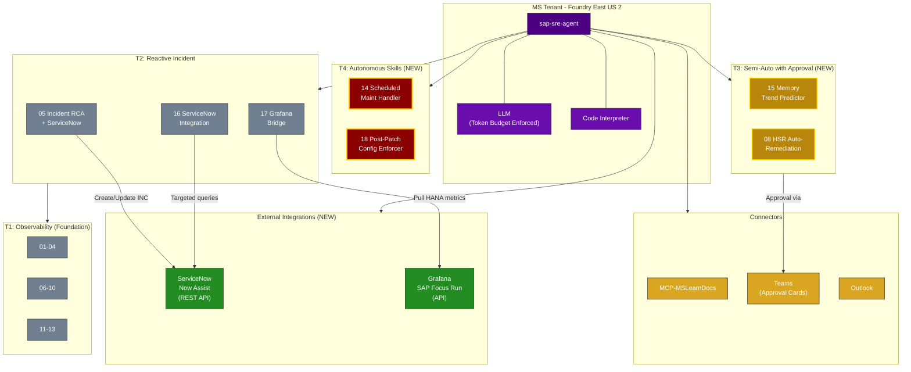

# Azure SRE Agent for SAP — Strategic Pivot v2

## Post-Demo Analysis & Next Steps (May 7, 2026)

---

## 1. Customer Feedback Synthesis

### What the customer said (paraphrased):
1. **Most skills are observability/productivity tools** — they help employees find information faster, but that information is already obtainable via portal, dashboards, or SSH. The marginal productivity gain doesn't justify the investment given their SI sourcing model.
2. **Only Skill 05 (Incident RCA) has real differentiation** — it does something humans struggle to do quickly (cross-layer correlation).
3. **They want outage-prevention proof** — "Show me past outages that this agent could have prevented, and quantify the monetary loss avoided."
4. **Cost governance is critical** — the agent must be laser-focused, not wastefully scanning 100K ServiceNow tickets to find 2 relevant ones. Token/GPU cost must be proportional to value delivered.
5. **Competitive landscape** — ServiceNow Now Assist is optimized for ITSM/incident tickets; SAP Focus Run (via Grafana) has deep SAP telemetry understanding. The Azure SRE Agent must find its **unique position** rather than competing head-on.
6. **Use-case categorization** — they want skills bucketed into 4 tiers (reconstructed below).

---

## 2. The Four-Tier Use-Case Framework

**Observe → Diagnose → Prevent → Heal**

| Tier | Name | Agent Behavior | What It Does | Example |
|------|------|---------------|-------------|---------|
| **T1** | **Observability & Insights** | **Read-Only** — observes, queries, reports | Continuously monitors SAP landscape health, detects configuration drift, surfaces proactive insights. Humans review dashboards and reports. | *"Show me HSR replication status for AB5"* — Agent queries AMS telemetry and returns a health report. No changes made. |
| **T2** | **Incident Diagnosis & RCA** | **Read-Only** — diagnoses, correlates, explains | Auto-triggered when an alert fires or incident is reported. Performs cross-layer root cause analysis (Azure → OS → Cluster → HANA → SAP App) in seconds, not hours. | *Alert: HANA Availability = 0* — Agent runs 5-layer RCA in 90 seconds, correlates with an Azure VM reboot event 2 minutes prior, generates RCA document ready for ServiceNow. |
| **T3** | **Predictive Prevention** | **Semi-Autonomous** — detects anomaly, recommends fix, human approves, agent executes | Identifies emerging risks via trend analysis and anomaly detection before they cause outages. Prepares remediation actions. Human approves via Teams Adaptive Card. Agent executes and validates. | *HANA memory trending to OOM in ~36 hours* — Agent recommends restarting the top memory-consuming service. Sends approval card to Teams. On approval, executes restart via command proxy and confirms recovery. |
| **T4** | **Autonomous Remediation** | **Fully Autonomous** — detects, decides, acts, validates, notifies | Handles time-critical scenarios where human approval would be too slow. Operates within strict guardrails (allowlisted actions only). Human notified after action is taken. | *Azure Scheduled Maintenance in 15 min* — Agent initiates graceful SAP shutdown, triggers HSR takeover to secondary, acknowledges event to Azure. Zero-downtime maintenance. Human receives Teams notification with full action log. |

### Current State — All 13 Skills Mapped to Tiers

| Skill | Current Tier | Gap |
|-------|-------------|-----|
| 01 Landscape Inventory | T1 | Foundational — stays as-is |
| 02 Capacity Readiness | T1 | Info retrieval only |
| 03 Monitoring Health | T1 | Info retrieval only |
| 04 Configuration Checks | T1 | **Detects drift but doesn't prevent/fix it** |
| 05 Incident RCA | T2 | **Only T2 skill — but still read-only** |
| 06 Performance Analysis | T1 | Info retrieval only |
| 07 HA Cluster Health | T1 | Info retrieval only |
| 08 HSR Replication Health | T1 | **Detects silent HSR failures but can't act** |
| 09 Infrastructure Health | T1 | Info retrieval only |
| 10 Storage Latency | T1 | Info retrieval only |
| 11 Resiliency Assessment | T1 | Info retrieval only |
| 12 Cost Analysis | T1 | Info retrieval only |
| 13 Live Command Runner | T1 | Read-only terminal — already available via SSH |

**Verdict: 12 of 13 skills are T1. One skill (05) is T2. Zero skills at T3 or T4.**

The customer is right — the current agent is overwhelmingly an observability/productivity tool.

---

## 3. The Honest Assessment — Where the Customer Is Right

### 3.1 The Productivity Argument Is Weak
- An SAP Basis admin can SSH into a system, run `SAPHanaSR-showAttr`, and see HSR status in 30 seconds.
- The agent does the same thing but via a proxy function, KQL query, or blob file. It's marginally faster but not transformative.
- With SI-sourced teams (often offshore), labor cost is low enough that "saving 15 minutes per check" doesn't move the needle.

### 3.2 The ServiceNow/SAP Focus Run Overlap
- **ServiceNow Now Assist**: Already has the incident history, ticket context, knowledge articles, and change correlation. It's the system of record for ITSM. Competing with it for incident management is foolish.
- **SAP Focus Run / Grafana**: Has native SAP telemetry (HANA memory pools, buffer cache hit ratios, lock wait analysis, BW query performance) at a depth that Azure Monitor/AMS will never match. It speaks HANA natively.
- **Azure SRE Agent's unique position**: It sits at the **infrastructure-to-application boundary**. It can see things neither ServiceNow nor Focus Run can: Azure platform events, VM maintenance, disk throttling, network drops, zone failures, load balancer health probes. And it can correlate those with SAP/HANA impact.

### 3.3 The Cost Governance Concern Is Valid
- A naive agent that queries 100K ServiceNow incidents using GPT-4 at ~$30/1M tokens could easily spend $500+ per investigation.
- The agent must use **indexed search first, LLM reasoning second** — never scan entire datasets through the LLM.
- Cost guardrails: token budgets per skill invocation, pre-filtered queries, cached embeddings for repeat patterns.

---

## 4. The Strategic Pivot — Outage Prevention & Closed-Loop

### The winning pitch: "This agent could have prevented your last 3 outages."

To make this compelling, we need to:
1. **Get their actual outage history** (sanitized) — even 3-5 Sev1/Sev2 incidents from the past 12 months.
2. **Reverse-engineer each outage** to show which signals were available hours/days before the outage that the agent would have caught.
3. **Quantify the cost** of each outage (downtime cost = revenue per hour × hours down + SLA penalties + recovery labor).
4. **Show the counterfactual** — with the agent, here's what would have happened instead.

### 4.1 Common SAP Outage Patterns the Agent Can Prevent

Based on industry data and our own AB5 experience, here are the top SAP outage categories:

| # | Outage Pattern | Frequency | Typical Cost | Agent Prevention Mechanism | Tier |
|---|---------------|-----------|-------------|---------------------------|------|
| **P1** | **HANA out of memory (OOM)** | Common | $50K-500K/incident | Agent monitors memory consumption trends via AMS. When usage crosses 80% threshold with upward trajectory, auto-creates ServiceNow incident + recommends specific HANA memory configuration changes. **Catches 24-48h before OOM kill.** | T3 |
| **P2** | **HSR replication broken silently** | Common | $100K-1M (if failover fails during real outage) | Agent continuously validates HSR sync state via Skill 08. When SFAIL detected, immediately alerts + optionally runs diagnostic commands to capture state before it's lost. **Current gap: detects but doesn't remediate.** | T3→T4 |
| **P3** | **Azure platform maintenance — unplanned VM reboot** | Periodic | $20K-200K | Agent monitors Azure Scheduled Events API (169.254.169.254/metadata/scheduledevents). On maintenance event, triggers SAP graceful shutdown sequence BEFORE Azure reboots the VM. **Zero-downtime maintenance.** | T4 |
| **P4** | **Disk throttling → HANA savepoint timeout → crash** | Common | $50K-300K | Skill 10 detects disk IOPS approaching limits. Agent opens change request to upsize disks or enable Write Accelerator. If critical (>95% consumed), agent can deallocate non-critical VMs to free burst credits. | T3 |
| **P5** | **Pacemaker split-brain / fencing storm** | Rare but catastrophic | $500K-2M | Agent monitors cluster quorum state and SBD heartbeat. On degraded quorum (1 of 2 nodes), preemptively sets maintenance mode to prevent fencing storm. Alerts human with full cluster state. | T3 |
| **P6** | **Configuration drift after patching** | Common | $20K-100K | Skill 04 runs post-patch validation. If sysctl params reverted (common after kernel update), agent auto-applies sysctl.d config via command proxy. **Closes the loop.** | T4 |
| **P7** | **Backup failure undetected for days** | Common | $50K-500K (if DR needed) | Agent monitors backup freshness daily. If last successful backup > 24h, escalates. If > 48h, triggers on-demand backup via HANA SQL. | T3→T4 |
| **P8** | **Certificate/credential expiration** | Periodic | $20K-100K | Agent monitors Key Vault certificate expiry, HANA license expiry, SSL cert dates. Alerts 30/14/7 days before expiry. | T3 |
| **P9** | **Log volume full → HANA crash** | Common | $50K-200K | Agent monitors /hana/log utilization. At 80%, triggers log backup + catalog cleanup. At 90%, emergency free-log-area operation. | T4 |
| **P10** | **Network latency spike → transaction timeouts** | Periodic | $20K-100K | Agent runs periodic niping baseline. When latency exceeds 2x baseline, correlates with Azure network metrics, identifies root cause (cross-zone traffic, throttled NIC, etc.), recommends PPG or AccelNet fix. | T3 |

### 4.2 Upgraded Skill Architecture — T1 → T2 → T3 → T4 Progression

```
┌─────────────────────────────────────────────────────────────┐
│ T4: FULLY AUTONOMOUS (Closed-Loop)                          │
│                                                             │
│  • Azure Scheduled Events → Graceful SAP shutdown           │
│  • Log volume >90% → Emergency backup + cleanup             │
│  • Config drift post-patch → Auto-apply sysctl.d            │
│  • Backup stale >48h → Trigger on-demand HANA backup        │
│                                                             │
├─────────────────────────────────────────────────────────────┤
│ T3: SEMI-AUTONOMOUS (Agent recommends + human approves)     │
│                                                             │
│  • Memory trend → "HANA OOM in ~36h, resize to X GB?"       │
│  • HSR broken → "Re-register secondary? [Approve/Deny]"     │
│  • Disk throttling → "Upsize to P30? Est. cost +$X/mo"      │
│  • Pacemaker degraded → "Set maintenance mode? [Approve]"   │
│  • Cert expiring → "Renew cert X in KV? [Approve]"          │
│                                                             │
├─────────────────────────────────────────────────────────────┤
│ T2: REACTIVE INCIDENT RCA (Auto-triggered diagnostics)      │
│                                                             │
│  • Alert fires → 5-layer RCA in 90 sec (not 45 min)         │
│  • Cross-correlate: Azure events + OS + Cluster + HANA      │
│  • Auto-generate RCA document for ServiceNow                 │
│  • Integrate with ServiceNow Now Assist (feed RCA to it)    │
│  • Integrate with Focus Run (pull HANA-deep telemetry)      │
│                                                             │
├─────────────────────────────────────────────────────────────┤
│ T1: OBSERVABILITY & PROACTIVE INSIGHTS (Current state)      │
│                                                             │
│  • Landscape inventory, capacity, monitoring health          │
│  • Configuration checks, performance baselines               │
│  • Cost analysis, resiliency assessment                      │
│  • (Foundation layer — feeds T2/T3/T4)                       │
│                                                             │
└─────────────────────────────────────────────────────────────┘
```

---

## 5. Competitive Positioning — The Integration Play

Instead of competing with ServiceNow and SAP Focus Run, **orchestrate them**.

```
┌──────────────────────────────────────────────────────────────────┐
│                     Azure SRE Agent (Orchestrator)                │
│                                                                  │
│   "The only agent that sees Azure infra + SAP app + ITSM"       │
│                                                                  │
│   ┌────────────┐    ┌────────────────┐    ┌────────────────┐    │
│   │ ServiceNow │    │  SAP Focus Run │    │  Azure Monitor │    │
│   │ Now Assist │    │  (via Grafana) │    │  + AMS + ARG   │    │
│   │            │    │                │    │                │    │
│   │ • Incidents│    │ • HANA deep    │    │ • Platform     │    │
│   │ • Changes  │    │   telemetry    │    │   events       │    │
│   │ • Problems │    │ • BW/EWM/APO   │    │ • VM metrics   │    │
│   │ • CMDB     │    │   performance  │    │ • Disk/Network │    │
│   │ • KB       │    │ • ABAP stats   │    │ • Resource     │    │
│   │            │    │ • Alert hist.  │    │   Health       │    │
│   └─────┬──────┘    └───────┬────────┘    └───────┬────────┘    │
│         │                   │                      │             │
│         └───────────────────┼──────────────────────┘             │
│                             │                                    │
│                    ┌────────▼────────┐                           │
│                    │  Correlation    │                           │
│                    │  Engine         │                           │
│                    │                 │                           │
│                    │ Azure event at  │                           │
│                    │ 03:14 → HANA   │                           │
│                    │ OOM at 03:15 → │                           │
│                    │ INC0012345 at  │                           │
│                    │ 03:18          │                           │
│                    └────────────────┘                           │
└──────────────────────────────────────────────────────────────────┘
```

### Integration Architecture:

| Integration | Method | What It Gets | What It Gives Back |
|------------|--------|-------------|-------------------|
| **ServiceNow** | REST API (Table API) or MCP connector | Incident history, change records, known errors, CMDB topology | Auto-generated RCA documents, recommended resolution, change requests |
| **SAP Focus Run / Grafana** | Grafana API (dashboard + datasource queries) | HANA detailed metrics (memory pools, SQL stats, buffer cache), SAP application KPIs, alert history | Infrastructure context for SAP-side alerts ("your HANA slowdown was caused by Azure disk throttling at 03:14") |
| **Azure Monitor / AMS** | Native (already connected) | Platform events, VM metrics, AMS telemetry, Resource Health | Foundation layer — always available |

### Key Integration Principle: **Targeted Queries, Not Bulk Scans**

To address the cost concern about scanning 100K ServiceNow tickets:

```
BAD:  "Scan all 100,000 incidents for patterns related to HANA memory"
      → 100K tickets × ~500 tokens each = 50M tokens = ~$1,500 in GPT-4

GOOD: "ServiceNow API: GET /api/now/table/incident?
         sysparm_query=cmdb_ci.name=AB5dbvm0
         ^opened_at>2025-05-01
         ^priority<=2
         ^short_descriptionLIKEHANA OR short_descriptionLIKEmemory
         &sysparm_fields=number,short_description,close_notes
         &sysparm_limit=20"
      → 20 tickets × ~500 tokens = 10K tokens = ~$0.30
      → Then LLM analyzes ONLY these 20 pre-filtered results
```

---

## 6. Cost Model for the Azure SRE Agent

### 6.1 Agent Operating Cost Breakdown

| Component | Monthly Cost (Est.) | Notes |
|-----------|-------------------|-------|
| **Azure AI Foundry (LLM)** | $200-600 | GPT-4o, ~2M tokens/day for 5 SAP systems, with caching |
| **Azure Functions (Proxies)** | $15-30 | Consumption plan, ~1000 invocations/day |
| **Storage (configs)** | $5-10 | ~1 GB blob storage for config snapshots |
| **Log Analytics (AMS)** | $100-300 | Already exists for SAP monitoring — marginal increase |
| **Application Insights** | $20-50 | Agent telemetry and tracing |
| **User Managed Identity** | $0 | Free |
| **Total Agent Cost** | **$340-990/mo** | **~$4K-12K/year** |

### 6.2 Token Budget Guardrails

| Skill Tier | Max Tokens/Invocation | Max Invocations/Day | Daily Token Budget |
|------------|----------------------|--------------------|--------------------|
| T1 (Observability) | 10K | 5 | 50K |
| T2 (Incident RCA) | 50K | 3 | 150K |
| T3 (Semi-Auto) | 30K | 5 | 150K |
| T4 (Autonomous) | 5K | 20 | 100K |
| **Total** | — | — | **~450K tokens/day** |

At GPT-4o pricing (~$2.50/1M input, $10/1M output), daily cost ≈ $2-5/day ≈ **$60-150/month for LLM**.

### 6.3 ROI Framework

```
Annual Agent Cost:          ~$12,000 (high estimate)
Cost of ONE Sev1 outage:    $100,000 - $2,000,000
  (4h downtime × $25K-500K/hr revenue impact)

Break-even: Prevent ONE Sev1 outage per year.
Typical SAP landscape: 2-5 Sev1 incidents/year.

Conservative ROI: ($100K avoided - $12K cost) / $12K = 733% ROI
Aggressive ROI:  ($500K avoided - $12K cost) / $12K = 4,067% ROI
```

---

## 7. FEMSA Demo Strategy (Friday, May 9)

### What to Change from the PepsiCo Demo

| PepsiCo Demo (May 7) | FEMSA Demo (May 9) | Why |
|----------------------|---------------------|-----|
| Showed all 13 skills | Show only 5-6 high-impact skills | Avoid "productivity tool" perception |
| Led with T1 (observability) | **Lead with T2/T3 (incident prevention)** | Show differentiation first |
| No competitive positioning | **Position as orchestrator** of ServiceNow + Focus Run + Azure | Address the "other agents" concern |
| No cost model | **Present cost model upfront** | Address governance concern proactively |
| Generic use-cases | **Use FEMSA-specific scenarios** (Order-to-Cash, sales process) | Make it tangible |

### Recommended Demo Flow for FEMSA

#### Scene 1: "The 3 AM Outage" (5 min) — T2
- Simulate: Azure platform event (VM maintenance) at 3 AM → HANA restart → SAP down
- Show: Agent auto-triggers 5-layer RCA within 90 seconds
- Show: Agent generates RCA document ready for ServiceNow
- Contrast: "Without the agent, your on-call SRE takes 45 minutes to SSH into 5 VMs, check logs, correlate timestamps, and write the RCA"

#### Scene 2: "The Silent Killer" (5 min) — T3
- Simulate: HSR replication breaks silently (SFAIL status)
- Show: Agent detects within 15 minutes via continuous monitoring
- Show: Agent creates ServiceNow incident with full diagnostic context
- Show: Agent recommends remediation steps with human approval gate
- Impact: "If your primary HANA fails while HSR is broken, you lose your entire DR capability. This happened to our AB5 system — it took 2 weeks to recover."

#### Scene 3: "The Predictable Crash" (5 min) — T3
- Simulate: HANA memory consumption trending upward over 72 hours
- Show: Agent detects the trend, projects OOM in ~36 hours
- Show: Agent recommends specific actions (restart specific service, increase memory, kill runaway queries)
- Show: Agent creates change request in ServiceNow with pre-populated details
- Impact: "Memory-related HANA crashes are the #1 cause of unplanned SAP downtime."

#### Scene 4: "The Integration Story" (3 min) — Positioning
- Show architecture diagram with ServiceNow + Focus Run + Azure
- Explain: "We don't replace ServiceNow or Focus Run. We connect them."
- Show: "When Focus Run sees HANA memory pressure, and Azure sees disk throttling, and ServiceNow shows a change was deployed 2 hours ago — only this agent connects all three to tell you the real root cause."

#### Scene 5: "The Business Case" (2 min) — Cost Model
- Show: Agent costs ~$12K/year
- Show: One prevented Sev1 = $100K-2M saved
- Show: Token budget guardrails — agent never overspends
- Show: Per-invocation cost tracking dashboard

### FEMSA-Specific Angles
- FEMSA has SAP Order-to-Cash flows — downtime = lost sales orders, delayed deliveries, billing failures
- FEMSA operates across multiple countries (Mexico, LATAM) — timezone coverage gaps where autonomous agent adds most value
- FEMSA likely uses SAP ECC (not S/4HANA yet) — Focus Run integration via Grafana is relevant

---

## 8. PepsiCo Long-Term Strategy

### Phase 1: Prove It (Weeks 1-4)
- Get 3-5 historical Sev1/Sev2 incident reports from PepsiCo
- Reverse-engineer each incident showing:
  - What signals were available before the outage
  - When the agent would have detected them
  - What the agent would have done (T2/T3/T4)
  - Cost of the actual outage vs. cost of prevention

### Phase 2: Build the T3/T4 Skills (Weeks 5-12)
Priority order for new/upgraded skills:

| Priority | New Capability | Current Skill Base | Upgrade Path |
|----------|---------------|-------------------|-------------|
| **P1** | Scheduled Events handler (graceful shutdown) | New skill | Azure Metadata API → SAP graceful stop → confirm restart |
| **P2** | Memory trend prediction + alerting | Skill 06 (Performance) | Add trend analysis + ServiceNow integration |
| **P3** | HSR auto-remediation with approval | Skill 08 (HSR Health) | Add re-register workflow with approval gate |
| **P4** | Post-patch config drift auto-fix | Skill 04 (Config Checks) | Add sysctl.d write-back via command proxy |
| **P5** | Backup freshness enforcement | Skill 03 (Monitoring) | Add on-demand backup trigger |
| **P6** | Log volume management | New skill | Monitor /hana/log + trigger cleanup |
| **P7** | ServiceNow bi-directional integration | Skill 05 (RCA) | REST API for incident create + update |
| **P8** | Focus Run / Grafana telemetry pull | New skill | Grafana API for HANA deep metrics |

### Phase 3: Governance Framework (Parallel)
- Token budget enforcement per skill per day
- Approval workflows for T3 actions (Teams Adaptive Card → approve/deny)
- Audit log of all agent actions (Application Insights)
- Monthly cost report comparing agent cost vs. outages prevented
- Kill switch — ability to disable T3/T4 immediately if governance concern

---

## 9. New Skills to Build

### 9.1 Skill 14: SAP Scheduled Maintenance Handler (T4)
```
Trigger:  Azure Scheduled Events API (polled every 30 sec from within VM)
Action:   1. Detect "Reboot" or "Redeploy" event
          2. If HANA primary → initiate graceful SAP stop sequence
          3. If HA → trigger planned HSR takeover to secondary
          4. Acknowledge event to Azure (starts 15-min countdown)
          5. Log everything to ServiceNow as planned maintenance
Result:   Zero-downtime Azure maintenance
```

### 9.2 Skill 15: HANA Memory Trend Predictor (T3)
```
Trigger:  Scheduled every 6 hours
Action:   1. Query AMS: SapHana_LoadHistory_CL (memory consumption last 7 days)
          2. Linear regression on memory trend
          3. If projected OOM within 72 hours:
             a. Identify top memory consumers (services, tables, statements)
             b. Recommend actions (restart service, increase allocation, kill query)
             c. Create ServiceNow incident with evidence
          4. If projected OOM within 12 hours:
             a. Auto-restart non-critical HANA services (with approval)
             b. Escalate to P1
Result:   Prevent HANA OOM crashes before they happen
```

### 9.3 Skill 16: ServiceNow Integration Hub (T2/T3)
```
Capabilities:
  - Create incidents with structured RCA data
  - Query incident history (targeted, filtered — NOT bulk scan)
  - Create change requests for T3 remediation actions
  - Update incidents with resolution notes
  - Pull knowledge articles for known issues
Auth:     ServiceNow REST API (OAuth 2.0 or API key)
Cost:     Targeted queries only — max 20 results per query
```

### 9.4 Skill 17: Grafana/Focus Run Telemetry Bridge (T2)
```
Capabilities:
  - Query Grafana dashboards for HANA-deep metrics
  - Pull Focus Run alert history
  - Correlate SAP-side events with Azure platform events
  - Enrich Skill 05 RCA with HANA-native telemetry
Auth:     Grafana API key (read-only)
Cost:     API calls only — no LLM processing of Grafana data
```

### 9.5 Skill 18: Post-Patch Config Enforcer (T4)
```
Trigger:  After VM restart detected (Activity Log: VM deallocate → start)
Action:   1. Run Skill 04 config checks on the restarted VM
          2. If drift detected (sysctl reverted, services not started):
             a. Auto-apply sysctl.d configs via command proxy
             b. Restart SAP services if needed
             c. Validate fix
          3. Log drift + fix to ServiceNow as informational
Result:   No more "we patched last night and forgot to re-apply sysctl"
```

---

## 10. What Makes Azure SRE Agent Uniquely Valuable

The **only agent** that can do all of these simultaneously:

| Capability | ServiceNow Now Assist | SAP Focus Run | Azure SRE Agent |
|------------|----------------------|---------------|-----------------|
| See Azure platform events (maintenance, throttling, zone issues) | ❌ | ❌ | ✅ |
| See HANA deep telemetry (memory pools, SQL stats) | ❌ | ✅ | ✅ (via AMS + Grafana bridge) |
| See ITSM context (past incidents, changes, KB) | ✅ | ❌ | ✅ (via ServiceNow API) |
| Correlate all three layers | ❌ | ❌ | **✅ — unique differentiator** |
| Execute Azure-level remediation (resize VM, upsize disk) | ❌ | ❌ | ✅ |
| Execute SAP-level commands (graceful stop, backup trigger) | ❌ | ✅ (limited) | ✅ (via command proxy) |
| Operate 24/7 without human (T4) | ❌ | ❌ (alerts only) | ✅ |

**The pitch**: "ServiceNow knows your tickets. Focus Run knows your HANA. Only the Azure SRE Agent knows your infrastructure AND can act on it. And when it connects all three, it can tell you things none of them can tell you alone."

---

## 11. Immediate Action Items

| # | Action | Owner | By When | For |
|---|--------|-------|---------|-----|
| 1 | Restructure demo to lead with T2/T3 scenarios | Abbas | May 8 (Thu) | FEMSA demo |
| 2 | Build Skill 05 → ServiceNow integration mockup | Abbas | May 8 | FEMSA demo |
| 3 | Prepare cost model slide (agent cost vs. outage cost) | Abbas | May 8 | FEMSA demo |
| 4 | Request 3-5 historical Sev1 incident reports from PepsiCo | Abbas | May 12 (Mon) | PepsiCo Phase 1 |
| 5 | Build Skill 14 (Scheduled Events Handler) prototype | Abbas | May 16 | PepsiCo demo |
| 6 | Build Skill 15 (Memory Trend Predictor) prototype | Abbas | May 23 | PepsiCo demo |
| 7 | Design ServiceNow API integration architecture | Abbas | May 16 | Both |
| 8 | Design Grafana API integration architecture | Abbas | May 23 | Both |
| 9 | Create token budget enforcement mechanism | Abbas | May 30 | Governance |
| 10 | Update architecture diagram to include ServiceNow + Grafana | Abbas | May 8 | FEMSA demo |

---

## 12. Updated Architecture Diagram



---

## 13. Consolidated Skill Architecture — "The Reboot"

### Design Principles
1. **Fewer, stronger skills** — 11 customer-facing skills (down from 13 all-T1), organized by tier
2. **Every tier has representation** — T1:5, T2:1, T3:3, T4:2
3. **Internal tools are hidden** — Live Command Runner, ServiceNow connector, Grafana bridge are internal capabilities, not customer-visible skills
4. **Naming conveys value, not function** — "Configuration Guardian" not "Configuration Checks"
5. **Each skill has a clear trigger model** — user asks, scheduled, alert-triggered, or event-triggered

### From → To Mapping

```
CURRENT (13 skills, all T1 except one T2)        PROPOSED (11 skills across 4 tiers)
─────────────────────────────────────────         ──────────────────────────────────────

01 Landscape Inventory ──────────┐
02 Capacity Readiness ───────────┤───────► T1.1 SAP Landscape & Capacity
                                 │
03 Monitoring Health Check ──────┤
09 Infrastructure Health Check ──┤───────► T1.2 SAP System Health Monitor
                                 │
04 Configuration Checks ─────────┼───────► T1.3 SAP Configuration Compliance
                                 │
06 Performance Analysis ─────────┤
10 Storage Latency Analysis ─────┤───────► T1.4 SAP Performance & Storage
                                 │
07 HA Cluster Health ────────────┤
08 HSR Replication Health ───────┤───────► T1.5 SAP HA & Replication Status
                                 │
11 Resiliency Assessment ────────┼───────► T1.6 SAP Resiliency Assessment
12 Cost Analysis ────────────────┼───────► T1.7 SAP Cost Analysis
                                 │
05 Incident RCA ─────────────────┼───────► T2.1 SAP Cross-Layer Incident RCA
                                 │            (+ ServiceNow + Grafana integrations)
                                 │
           (NEW) ────────────────┼───────► T3.1 SAP Anomaly Detection & Forecasting
04 Config Checks (upgraded) ─────┼───────► T3.2 SAP Configuration Guardian
07+08 (upgraded) ────────────────┼───────► T3.3 SAP HA Readiness Guardian
                                 │
           (NEW) ────────────────┼───────► T4.1 SAP Maintenance Autopilot
           (NEW) ────────────────┼───────► T4.2 SAP Self-Healing Operations

13 Live Command Runner ──────────┼───────► (Internal Tool — not a customer skill)
     ServiceNow Connector ───────┼───────► (Internal Tool — used by T2/T3)
     Grafana Bridge ─────────────┘───────► (Internal Tool — used by T2/T3)
```

---

### Complete Skill Catalog

#### T1: Observability & Insights (Read-Only) — 7 Skills

| ID | Skill Name | Consolidates | Trigger | What It Does | Demo System |
|----|-----------|-------------|---------|-------------|-------------|
| **T1.1** | **SAP Landscape & Capacity** | 01 + 02 | User asks | Discovers all SAP systems (SIDs, VMs, roles, topology, zones). Checks SKU availability, quota, and SAP certification for new deployments. Single source of truth for all other skills. | AB1, AB3, HSO |
| **T1.2** | **SAP System Health Monitor** | 03 + 09 | User asks or scheduled | Unified "is everything healthy?" dashboard. Checks: AMS provider health + data freshness, VM power state + CPU/memory/disk metrics, accelerated networking, proximity placement, Resource Health, alert coverage. Traffic-light output per layer. | AB1, AB3, HSO |
| **T1.3** | **SAP Configuration Compliance** | 04 (stays standalone) | User asks or scheduled | 59 STAF-aligned checks across infrastructure, storage, OS/SAP parameters, and cluster configuration. Detects drift from SAP best practices. Too important and detailed to merge. | AB1, AB3, HSO |
| **T1.4** | **SAP Performance & Storage** | 06 + 10 | User asks | "Why is SAP slow?" — HANA memory pressure, blocking transactions, long-running SQL, work process utilization, dialog response time, disk IOPS/MBPS throttling, Write Accelerator status, HANA savepoint duration, ANF throughput. | AB1, AB3 |
| **T1.5** | **SAP HA & Replication Status** | 07 + 08 | User asks | Unified HA health: Pacemaker nodes online, resources started, fail-counts, maintenance state, HSR sync status, replication mode/lag, SR hook registration, takeover readiness. One skill for the complete HA picture. | HSO |
| **T1.6** | **SAP Resiliency Assessment** | 11 (stays standalone) | User asks | Zone coverage, SPOFs, LB redundancy, disk zone alignment, DR readiness. Answers "can we survive a zone failure?" | AB1, AB3, HSO |
| **T1.7** | **SAP Cost Analysis** | 12 (stays standalone) | User asks | Per-system cost breakdown, RI coverage, deallocated VM savings, SRE agent operating cost. | AB1, AB3, HSO |

**Why 7 and not fewer?** T1.3 (config compliance, 59 checks) and T1.5 (HA, cluster+HSR) are each complex enough to warrant their own instruction set. Merging them further would exceed Foundry skill instruction limits and confuse LLM routing.

---

#### T2: Incident Diagnosis & RCA (Read-Only + Integrations) — 1 Skill

| ID | Skill Name | Consolidates | Trigger | What It Does | Demo System |
|----|-----------|-------------|---------|-------------|-------------|
| **T2.1** | **SAP Cross-Layer Incident RCA** | 05 (upgraded) | Alert-triggered or user asks | Bottom-up 5-layer root cause analysis (Azure → OS → Cluster → HANA → SAP App) in 90 seconds. Correlates platform events, metrics, telemetry, activity log, and change history. **New**: auto-generates ServiceNow incident with structured RCA. **New**: pulls Grafana/Focus Run HANA telemetry to enrich analysis. | AB1, AB3, HSO |

**Integrations baked in** (not separate skills):
- ServiceNow: Creates incident via REST API with RCA payload, queries recent changes for correlation
- Grafana: Pulls Focus Run HANA metrics to add HANA-native depth to Azure-side RCA

---

#### T3: Predictive Prevention (Semi-Autonomous) — 3 Skills

| ID | Skill Name | Consolidates | Trigger | What It Does | Demo System |
|----|-----------|-------------|---------|-------------|-------------|
| **T3.1** | **SAP Anomaly Detection & Forecasting** | NEW (uses 06 data sources) | Scheduled (every 6h) or user asks | Trend analysis on HANA memory, disk utilization, CPU, and replication lag. Linear regression projects resource exhaustion (OOM, disk full, log volume full). When threshold crossed: sends Teams Adaptive Card with recommended action + approval button. On approval: executes recommended action via command proxy. | AB1, AB3 |
| **T3.2** | **SAP Configuration Guardian** | 04 (upgraded to T3) | Post-VM-restart trigger (Activity Log) or scheduled (daily) | Runs the same 59 config checks as T1.3, but **acts on findings**. When drift detected post-patching (sysctl reverted, services not started): prepares remediation commands, sends approval card, on approval executes fix and re-validates. Closes the detect-fix loop. | AB1 |
| **T3.3** | **SAP HA Readiness Guardian** | 07 + 08 (upgraded to T3) | Scheduled (every 15 min) or alert-triggered | Continuous HSR + cluster validation. When SFAIL detected, quorum degraded, or fail-count increasing: immediately alerts via Teams with full diagnostic context + recommended actions (re-register secondary, clear fail-counts, set maintenance mode). On approval: executes remediation. | HSO |

**Key difference from T1 counterparts**: T1 skills observe and report. T3 skills observe, project, recommend, and (with approval) act.

---

#### T4: Autonomous Remediation (Fully Autonomous) — 2 Skills

| ID | Skill Name | Consolidates | Trigger | What It Does | Demo System |
|----|-----------|-------------|---------|-------------|-------------|
| **T4.1** | **SAP Maintenance Autopilot** | NEW | Azure Scheduled Events API (event-triggered) | Polls Azure metadata for scheduled maintenance events. On detection: initiates graceful SAP shutdown sequence (stopsap → HDB stop), triggers HSR takeover if HA, acknowledges event to Azure, monitors restart, validates SAP recovery post-maintenance. Human notified via Teams with full action log. Zero-downtime maintenance. | AB1 (stop/start), HSO (takeover) |
| **T4.2** | **SAP Self-Healing Operations** | NEW | Event-triggered (multiple triggers) | Handles time-critical scenarios autonomously within strict guardrails. **Scope**: (a) /hana/log >90% → trigger log backup + catalog cleanup, (b) Backup stale >48h → trigger on-demand HANA backup, (c) Sysctl drift after unplanned reboot → auto-apply sysctl.d. All actions from a **fixed allowlist** — no arbitrary commands. Every action logged to Application Insights + Teams notification. | AB1 |

**Guardrails for T4**:
- Only allowlisted actions can execute (no arbitrary shell)
- Token budget: max 5K tokens per invocation
- Rate limit: max 20 autonomous actions per day
- Kill switch: disable via Application Settings flag
- Every action logged with before/after state
- Human notified via Teams within 60 seconds of action

---

#### Internal Tools (Not Customer-Facing)

| Tool | What It Enables | Used By |
|------|----------------|---------|
| **Live Command Runner** | Executes 14+ allowlisted commands on VMs via command proxy | T3.2 (config fix), T3.3 (cluster commands), T4.1 (SAP stop/start), T4.2 (backup trigger) |
| **ServiceNow Connector** | Creates/updates incidents, queries change history, pulls KB articles via REST API | T2.1 (RCA → incident), T3.1 (anomaly → change request), T3.3 (HA alert → incident) |
| **Grafana Bridge** | Queries Focus Run dashboards for HANA-native telemetry via Grafana API | T2.1 (enrich RCA), T3.1 (memory deep-dive) |

---

### Summary: Before vs. After

| Metric | Before (Current) | After (Proposed) |
|--------|------------------|-----------------|
| Total customer-facing skills | 13 | **11** |
| T1 (Observability) | 12 | **7** (consolidated) |
| T2 (Incident RCA) | 1 | **1** (upgraded with integrations) |
| T3 (Predictive Prevention) | 0 | **3** (NEW) |
| T4 (Autonomous Remediation) | 0 | **2** (NEW) |
| Internal tools | 1 (command runner) | **3** (command runner + ServiceNow + Grafana) |
| Skills that take action | 0 | **5** (3 semi-auto + 2 autonomous) |
| Competitive differentiation | Weak (productivity only) | **Strong** (prevention + autonomous) |

### Command Proxy Expansion Needed

The current command proxy has 14 read-only commands. T3/T4 skills need **write commands** added to the allowlist:

| New Command ID | Action | Used By | Risk |
|---------------|--------|---------|------|
| `sysctl_apply` | Apply sysctl.d config file | T3.2, T4.2 | Low — applies existing config |
| `sap_stop_graceful` | `sapcontrol -function StopSystem` | T4.1 | Medium — stops SAP |
| `sap_start` | `sapcontrol -function StartSystem` | T4.1 | Low — starts SAP |
| `hdb_stop` | `HDB stop` as sidadm | T4.1 | Medium — stops HANA |
| `hdb_start` | `HDB start` as sidadm | T4.1 | Low — starts HANA |
| `hana_log_backup` | `hdbsql ALTER SYSTEM CREATE DATA BACKUP` | T4.2 | Low — triggers backup |
| `hana_log_cleanup` | `hdbsql BACKUP CATALOG DELETE ... BEFORE` | T4.2 | Medium — purges old catalog |
| `crm_maintenance_on` | `crm node standby <node>` | T3.3 | Medium — removes node from cluster |
| `crm_maintenance_off` | `crm node online <node>` | T3.3 | Low — returns node to cluster |
| `crm_cleanup` | `crm resource cleanup <rsc>` | T3.3 | Low — clears fail-counts |

**Security**: Each write command gets its own regex validation in the proxy. No parameter injection possible. The proxy validates exact command format before execution.

---

## Appendix A: Token Cost Estimation per Scenario

| Scenario | Steps | Est. Tokens | Est. Cost |
|----------|-------|-------------|-----------|
| T2: Full 5-layer RCA | 5 KQL queries + correlation | 40K | $0.40 |
| T3: Memory trend analysis | 1 KQL query + regression + recommendation | 15K | $0.15 |
| T3: HSR remediation recommendation | 2 KQL queries + command output + recommendation | 20K | $0.20 |
| T4: Scheduled event handler | Metadata API + SAP stop commands | 5K | $0.05 |
| T4: Post-patch config fix | Config check + sysctl apply | 8K | $0.08 |
| ServiceNow incident creation | Filtered query (20 results) + RCA formatting | 12K | $0.12 |
| Grafana metric pull | 3 dashboard queries + correlation | 10K | $0.10 |

**Worst case daily total**: ~450K tokens ≈ **$4.50/day ≈ $135/month for LLM alone**

---

## Appendix B: Questions to Ask FEMSA Before Demo

1. What SAP systems do you run on Azure? (ECC, S/4HANA, BW, SRM?)
2. How many Sev1/Sev2 incidents in the past 12 months?
3. Do you use ServiceNow? What ITSM tool?
4. Do you have SAP Focus Run / Solution Manager?
5. What's your current monitoring stack? (AMS, Grafana, Prometheus, custom?)
6. Do you have offshore SRE teams? What's the timezone coverage model?
7. What's your estimated cost per hour of SAP downtime?
8. Are you using Pacemaker HA? Which SAP systems?
9. What's your DR strategy? (HSR, backint, storage replication?)
10. Any specific outage patterns you've seen repeatedly?
